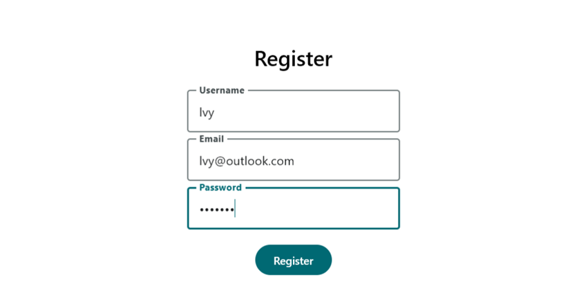
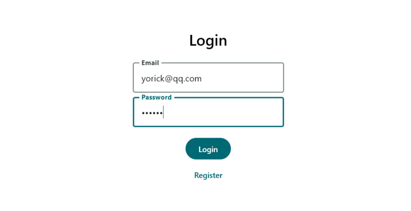
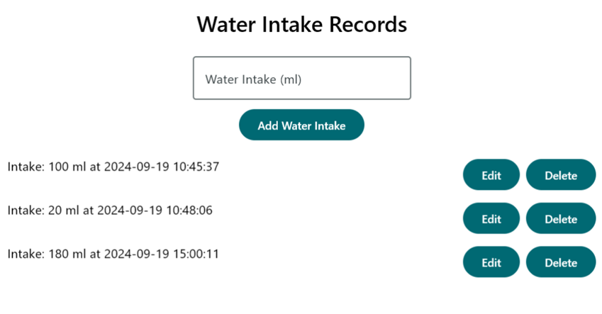

# Water-CURD
此App使用Compose Desktop实现了简单的喝水记录功能。

1. 注册和登录模块：注册新用户，登录现有用户。


2. 饮水记录模块：添加、修改、删除和获取用户的饮水记录。


使用前请修改数据库配置

1. 建表
```sql
CREATE TABLE users (
    user_id INT AUTO_INCREMENT PRIMARY KEY,
    username VARCHAR(50) NOT NULL,
    email VARCHAR(100) UNIQUE NOT NULL,
    password VARCHAR(255) NOT NULL,
    created_at TIMESTAMP DEFAULT CURRENT_TIMESTAMP
);

CREATE TABLE water_intake (
    intake_id INT AUTO_INCREMENT PRIMARY KEY,
    user_id INT NOT NULL,
    intake_amount_ml INT NOT NULL,
    intake_time TIMESTAMP DEFAULT CURRENT_TIMESTAMP,
    FOREIGN KEY (user_id) REFERENCES users(user_id)
);
```

2. 修改`DatabaseConfig`中的配置信息
```kotlin
import java.sql.Connection
import java.sql.DriverManager
import java.sql.SQLException

object DatabaseConfig {
    private const val URL = "jdbc:mysql://localhost:3306/database_name"
    private const val USER = "username"
    private const val PASSWORD = "password"

    fun getConnection(): Connection {
        return DriverManager.getConnection(URL, USER, PASSWORD)
    }
}
```

99%代码由ChatGPT 4o生成！

This is a Kotlin Multiplatform project targeting Desktop.

* `/composeApp` is for code that will be shared across your Compose Multiplatform applications.
  It contains several subfolders:
  - `commonMain` is for code that’s common for all targets.
  - Other folders are for Kotlin code that will be compiled for only the platform indicated in the folder name.
    For example, if you want to use Apple’s CoreCrypto for the iOS part of your Kotlin app,
    `iosMain` would be the right folder for such calls.


Learn more about [Kotlin Multiplatform](https://www.jetbrains.com/help/kotlin-multiplatform-dev/get-started.html)…